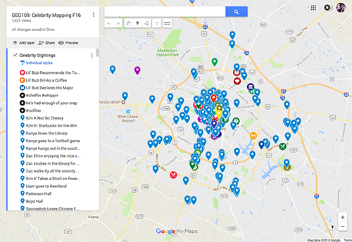

# Geography 109:  Digital Mapping

University of Kentucky

Matthew W. Wilson

## Mapping 1: Celebrity Mapping

In this first of four mapping assignments before your final project, you will explore the opportunities of collaborative digital mapmaking. You will use the following technologies:
* [Google MyMaps](https://www.google.com/mymaps)
* [Keyhole Markup Language (KML)](https://en.wikipedia.org/wiki/Keyhole_Markup_Language)

Follow the instructions, [here](mapping-1-instructions.md).