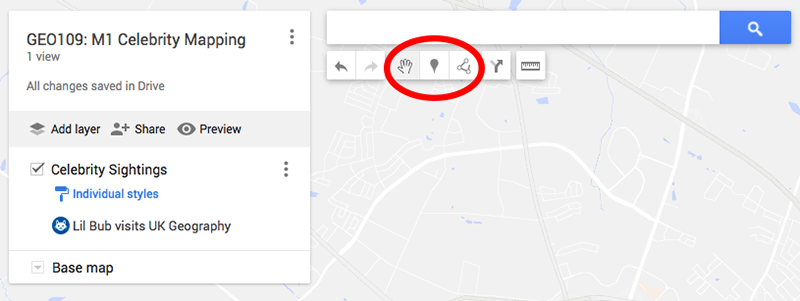
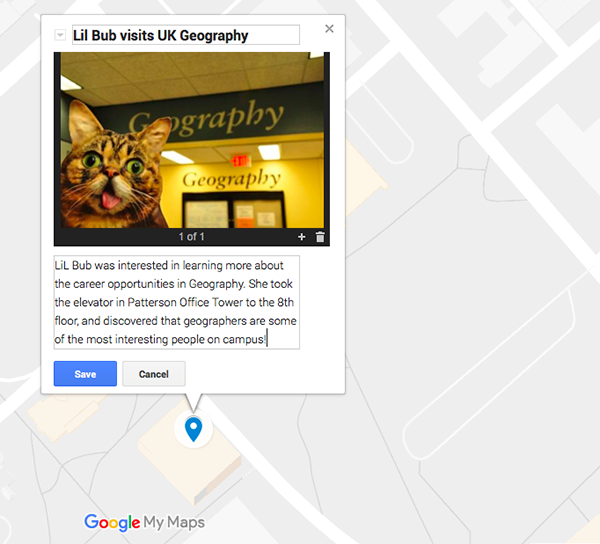

# Geography 109: Digital Mapping Mapping 1: Celebrity Mapping

University of Kentucky
 Matthew W. Wilson

In this exercise, the class will produce a Google Map of hundreds of geotagged photos documenting celebrity sightings in Lexington. Your job is to 1) photograph a chosen celebrity at three locations in Lexington, and 2) add those photos, along with some descriptive text, to a class-wide collaborative map using Google MyMaps.

**Note:** There are 10 steps in this assignment.

## Grading.

The assignment is worth 25 points, based on a Word document (or PDF) you will upload to Canvas containing:
1. Three screenshots demonstrating that you successfully geotagged three images to the collaborative map (15 points). Paste these three images into your Word document.
2. A 250-word essay (10 points) responding to the following prompt: **How does the collaboratively-produced map reflect the specific geographies of our classmates?** Consider where geotagged images were posted and where they are absent (as well as what celebrities were selected and written about).

Consult the [syllabus schedule](../syllabus.md#viii-schedule) for the due date of this assignment. **Note:** Late submissions will be penalized, as discussed in the syllabus.

**Note:** This assignment requires a digital camera or a camera phone. You are encouraged to borrow from friends and classmates, but if access to this technology is difficult, please inform your TA.

## Instructions.

1. Print, find in a magazine, or draw a favorite celebrity or character. Cut out the celebrity and mount it to a Popsicle stick or pencil.

2. Take your celebrity on a tour of Lexington, taking photos along the way. Explore places you’ve never been! Photographing your celebrity in multiple places enriches the final collaborative map.

3. Select three photos from your Lexington tour and rename them
by right-clicking the file, and selecting ‘rename.’ Use the following naming convention: *yourlastname_#*.jpg (e.g., wilson_1.jpg, wilson_2.jpg, wilson_3.jpg).

4. Create/sign into a [Google account](https://myaccount.google.com/). Your g.UKY email will likely not work for this assignment, even if you use the Gmail version). You must start by signing into a non-UKY Google account. **Note:** If you object to creating a non-UKY Google account, please inform your TA.

5. Navigate to the Google MyMaps for our class, [here](https://drive.google.com/open?id=1yE3DQCQvpT6YlbqdeQX6xj0jo7tmA_Wu&usp=sharing). **Note:** In order to edit this map you must be logged into your non-UKY Google account.

6. Add a new marker at the location of your first photo using the marker tool. 

7. Use the camera icon to upload your first photo and add a couple sentences to describe what your celebrity was doing in this location.  

8. Congratulations! You have geotagged your first image. Take a screenshot of this geotagged image using print screen (PtrScr key Windows or Command-Shift-3 in MacOS). Now open the Word doc you will be turning in, and paste/upload your screenshot. **Note:** You will need all three screenshots of your geotagged images to receive full credit.

9. In your Word doc, below your three screenshots of your three geotagged images, please write a 250-word essay using the  prompt, [above](mapping-1-instructions.md#grading).

10. Upload this Word doc to Canvas before the due date.