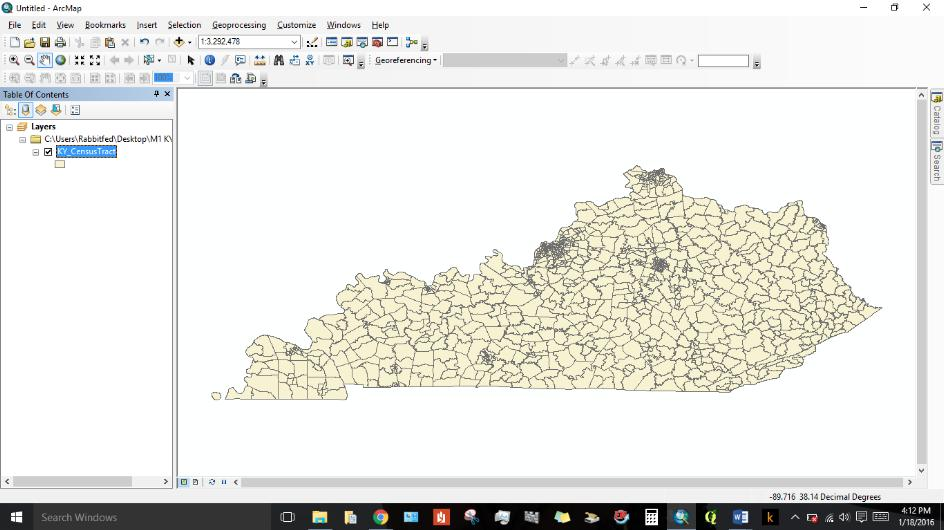

# Geography 109:  Digital Mapping

University of Kentucky
 Matthew W. Wilson

## Mapping 2: Introduction to ArcGIS

In this second of four mapping assignments before your final project, you will explore the opportunities of digital mapmaking using a desktop geographic information system. You will use the following technologies:

* [Esri ArcGIS Desktop - ArcMap](https://desktop.arcgis.com/en/arcmap/)
* [ZIP file format (ZIP)](https://en.wikipedia.org/wiki/Zip_(file_format))
* [Shapefile (SHP)](https://en.wikipedia.org/wiki/Shapefile)

Follow the instructions, [here](mapping-2-instructions.md).