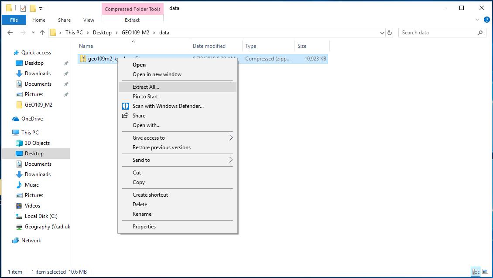
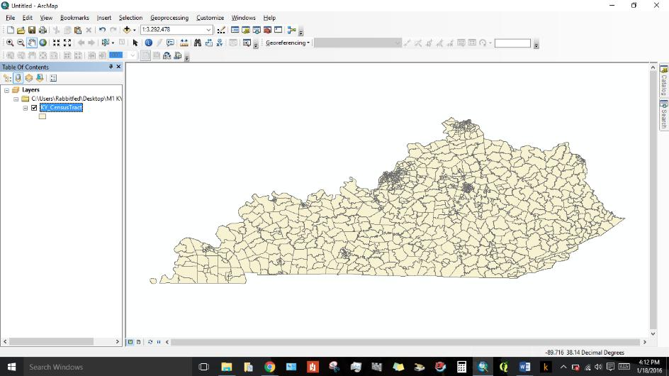
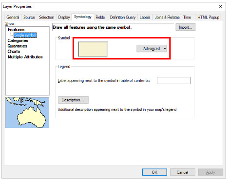

# Geography 109: Digital Mapping Mapping 2: Introduction to ArcGIS

University of Kentucky
 Matthew W. Wilson

In this exercise, you will bring in, and edit the design of, a map of the commonwealth of Kentucky to become familiar with the basic functions of Esri’s ArcGIS, an industry-standard geographic information system (GIS). After completing this assignment, you will have

1) the ability to navigate ArcGIS ArcMap and 
2) a basic understanding of the file and data structures used by ArcGIS.

**Note:** There are 17 steps in this assignment.

## Grading

The assignment is worth 25 points, based on a Word document (or PDF) you will upload to Canvas containing:
1. Three screenshots: the unstyled Kentucky layer, the 'not well designed map', and your much-improved 'well designed' map. Paste these three images into your Word document (15 points).
2. Responses to the three questions in the assignment (10 points).

**Due:** Consult the [syllabus schedule](../syllabus.md#viii-schedule) for the due date of this assignment. **Note:** Late submissions will be penalized, as discussed in the syllabus.

**Note:** This assignment assumes that you are using ArcGIS ArcMap in the teaching lab (CB313). We recommend completing the lab in one sitting. If you are unable to be in the teaching lab, please let the instructor know.

## Instructions

1. Before you open ArcGIS ArcMap, there are some steps you can take to make it easier to stay organized. In a simple project like this one, organization may seem unimportant, but it is never too early to start thinking about directory structures (i.e., which things go in which folders). First, right-click your desktop and select New > Folder. Name this new folder **_GEO109_M2_**.

2. Open your new folder. You will now create a folder within a folder. Right-click anywhere in your empty folder, select New > Folder, and name the new folder **_data_**. You now have a general project folder (GEO109_M2) and a subfolder for data files (data).

3. Download the [geo109m2_ky_shapefile.zip](assets/data/geo109m2_ky_shapefile.zip) file to your GEO109_M2/data folder. After it finishes downloading, locate the file (this should be easy to do as your new folder is on your desktop). Right click on the ZIP file, and select Extract All... and then click Extract.

4. You’ll see that five files have been extracted from the ZIP file. Esri, the company that owns ArcGIS, developed the shapefile as a way of storing spatial data. It includes location, shape, and attributes. A shapefile is always made up of at least four files that work together like a little basketball team. **Although only one has the .shp extension, if you do not extract them all, or you delete any, it will not work.**

5. Open ArcMap. The “Getting Started” screen will appear. Create a new map using the **_Blank Map_** template (it should be selected by default).

6. Once you have a blank map, click the “add data” button. Many of the buttons are intuitive: even if we didn’t tell you where they were, you would be able to figure it out. This one has a big plus sign.

7. The program will ask you where to find the data. Arc is a little quirky – it doesn’t just let you add any old file. First, you must connect ArcMap to the folder that contains your project. Find the **_Connect to Folder_** button at the top of the dialogue box.

8. Select your project folder. This will connect ArcMap to your project folder, after which ArcMap will be able to access any file within it.

9. Navigate into your **_data_** folder, select your shapefile, and click _Add_. Note the differences between the five files on your desktop, and the single one that appears when you connect to the desktop from ArcMap!

10. Congratulations! You’ve just made your first map. **Take a screenshot!**

11. Now you get to change how it looks. This map of Kentucky is called a **_layer_** and it is the only layer you currently have. Go into the **_layer properties_** of this layer by right-clicking the layer and scrolling to _layer properties_ or double clicking the layer. Explore the different menu tabs in this dialogue box to get a sense of the different things you can do to each layer.

12. Now go to the **_Symbology_** tab and explore your options here. Below is an example of an interesting map choice; I chose the mangrove pattern, made the fill purple, then removed the outlines (so you can no longer see the census tracts). Even though this is a very artistic interpretation of Kentucky, this is not well designed if the goal of mapping this data is to see and examine Kentucky's census tracts.

13. Make your own _"not well designed"_ map. We’re going to change the background color. Go to View > **_Data frame Properties_**. Now we are changing not just the layer, but the whole map. Once in properties, go to the **_frame_** tab, and choose your background color. Return to the layer properties screen (see step 5). Change the layer’s symbol fill color and outlines, as well as the map background to make your own _"not well designed"_ map. **Screenshot it!**

14. You’ve put some work into making your map... it would be a pity to lose it! Select **_Save As_** from the _File_ dropdown menu. Save it to your project folder, and name it **_M2.mxd_**. You’ve just saved an ArcMap project file or an _.mxd_.

15. Now go back into the **_Symbology_** tab and fix it. Pick a fill and outline color of your choice, adjusting line weight and anything else you would like. Change the background color (your choice; white is fine). **Capture a screenshot of your well designed map**.

16. **In a Word document, include your three screenshots, and answer these three questions in about a paragraph each.** Reference readings and material covered in lecture and recitation:

	* Q1. Explain choices for your maps; what made one odd and the other well designed? Think about who your audience might be and issues of readability as well as aesthetics. There is no wrong or right map as long as you can think through and defend your choices.
	* Q2. What is a Shapefile? Who was it developed by and what does it do? You don’t have to be too technical, just write your observations from this lab. Feel free to search online to help clarify things, though you should be careful to **cite your sources**.
	* Q3. Write a short review of ArcMap. Now that you’ve made a map using Google MyMaps, you can compare issues of cost, accessibility, ease, interface, design, and to some extent, what the different mapping programs allow you to do. You might think about expert/amateur mapping.

17. **Upload a Word document or PDF to Canvas**. This document must include your three screenshots and your responses to the questions.
