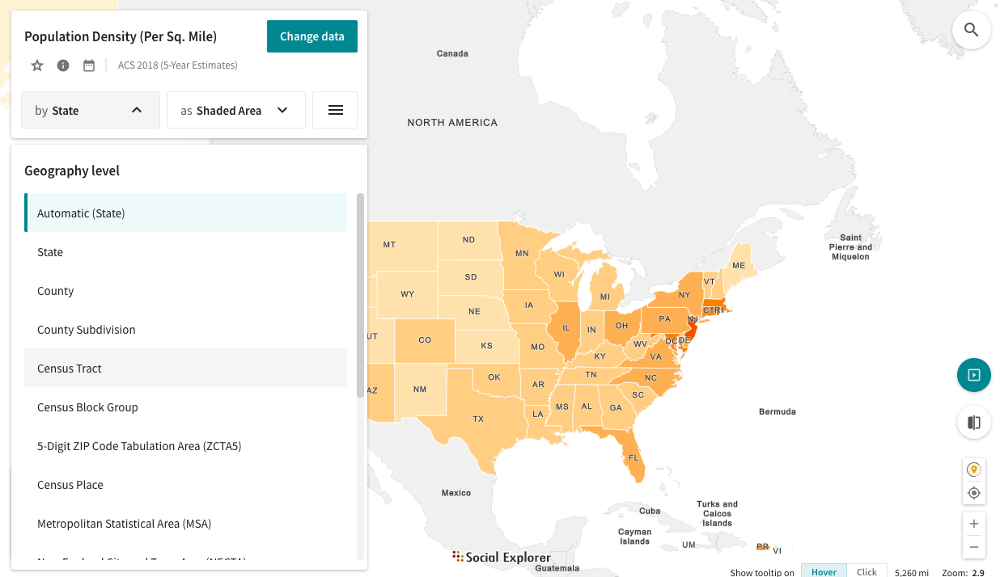

# Geography 109: Digital Mapping Mapping 3: Official Data Stories

University of Kentucky
 Matthew W. Wilson

In this exercise, you will produce a series of choropleth maps using Social Explorer, an online mapping application that produces simple, attractive maps of US Decennial Census and American Community Survey data. This will require you to fix a critical eye on your own cartographic decision-making, recognizing the active role that apparently aesthetic decisions play in shaping the stories maps tell. You will also develop a basic understanding of data classification methods.

**Note:** There are xx steps in this assignment.

## Grading.

The assignment is worth 30 points, based on a Word document (or PDF) you will upload to Canvas containing:
1. Three maps: two-side-by-side comparison maps and one single pane—exported from Social Explorer. **These must be exports and not screenshots** (15 points).
2. Responses to the three questions at the conclusion of the assignment (15 points).

Consult the [syllabus schedule](../syllabus.md#viii-schedule) for the due date of this assignment. **Note:** Late submissions will be penalized, as discussed in the syllabus.

**Note:** This assignment assumes that you are using the University of Kentucky license for Social Explorer. Follow the instructions carefully to ensure that you are utilizing this license.

## Instructions.

1. To begin, you will need to create a Social Explorer account and log in. Access Social Explorer through the library (available at http://libraries.uky.edu/record.php?lir_id=1147). Once you're logged in, double check that the University of Kentucky is noted as the license provider in the top right corner of the Social Explorer website. 

2. Once you have logged in, click on the Maps tab near the top of the screen. Then click the red “START NOW” button to begin mapping.  Social Explorer will then prompt you to either "Take a Tour" of its interface or "Skip" it and immediately start mapping. Feel free to take the tour, but the magic starts when you start mapping.

3. We will now spend some time exploring the interface. Click the "Show data by" button to open a drop-down menu where you choose between several data geometries. Turn off the automatic selection option and select "Census Tract". 

