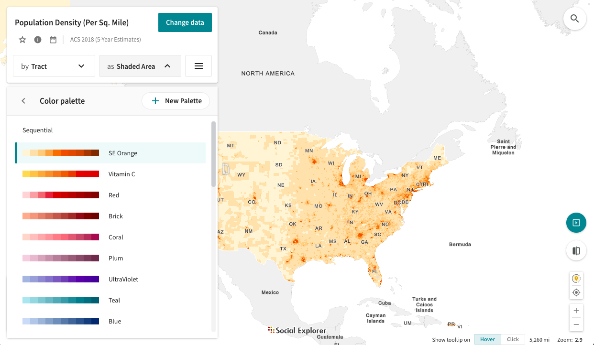
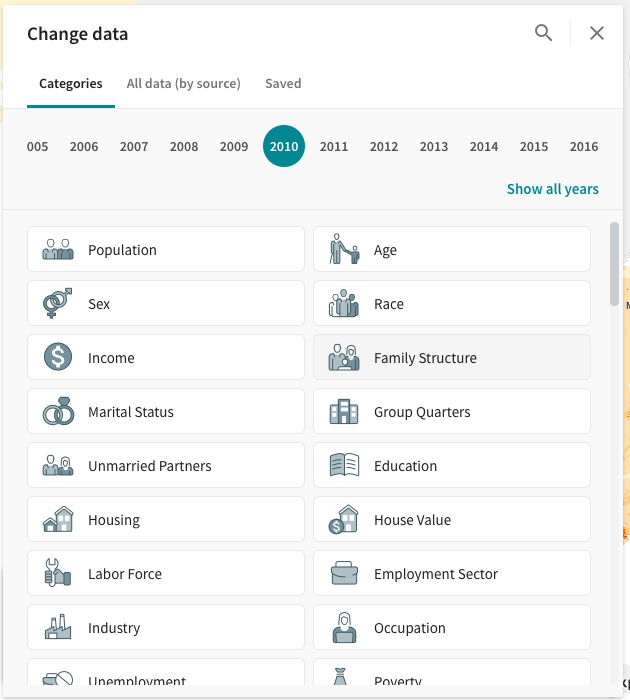

# Geography 109: Digital Mapping Mapping 3: Official Data Stories

University of Kentucky
 Matthew W. Wilson

In this exercise, you will produce a series of choropleth maps using Social Explorer, an online mapping application that produces simple, attractive maps of US Decennial Census and American Community Survey data. This will require you to fix a critical eye on your own cartographic decision-making, recognizing the active role that apparently aesthetic decisions play in shaping the stories maps tell. You will also develop a basic understanding of data classification methods.

**Note:** There are 11 steps in this assignment's instructions, followed by a [section](mapping-3-instructions.md#deliverables) on what to submit for the deliverable.

## Grading.

The assignment is worth 30 points, based on a Word document (or PDF) you will upload to Canvas containing:
1. Three maps: two-side-by-side comparison maps and one single pane—exported from Social Explorer. **These must be exports and not screenshots** (15 points).
2. Responses to the three questions at the conclusion of the assignment (15 points).

Consult the [syllabus schedule](../syllabus.md#viii-schedule) for the due date of this assignment. **Note:** Late submissions will be penalized, as discussed in the syllabus.

**Note:** This assignment assumes that you are using the University of Kentucky license for Social Explorer. Follow the instructions carefully to ensure that you are utilizing this license.

## Instructions.

1. To begin, you will need to create a Social Explorer account and log in. Access Social Explorer through the library (**available at [http://libraries.uky.edu/record.php?lir_id=1147](http://libraries.uky.edu/record.php?lir_id=1147)**). Once you're logged in, double check that the University of Kentucky is noted as the license provider in the top right corner of the Social Explorer website. 

2. Once you have logged in, click on the Maps tab near the top of the screen. Then click the red **Start Now** button for the _U.S. Demography_ map to begin mapping.  Social Explorer will then prompt you to either Take a Tour of its interface or Skip it and immediately start mapping. Feel free to take the tour, but the magic starts when you start mapping.

3. We will now spend some time exploring the interface. Click the **Show Data By** button to open a drop-down menu where you choose between several data geometries. Turn off the _Automatic_ selection option and select _Census Tract_. 

4. Click the **color scale** in the top right hand corner and select **Colors** at the bottom of the drop-down menu. Note the difference between Diverging and Sequential color modes here. Explore how these color scale options might affect the story told by your map. 

5. Click the **color scale** in the top right hand corner again. Instead of clicking Colors, select **Cutpoints**. From here you can change the data classification model. **Note:** Here, you can change both the *method* of data classification, and the *number of classes* into which the data is divided. Explore how these options affect the symbology. 

6. **Change the Map Layout** by pressing the gray button at the bottom of the screen in the middle. **Note:** You can create Side-by-Side and Swipe maps for easy comparison. Since we will be comparing similar maps in this assignment, we will use the Side-by-Side layout. 

7. **Click the Export button** at the top of the screen. Note that you can download your maps as images (.png) or as zip files at a resolution of your choosing. **Export your maps as PNG images.**

8. Finally, click the **Change Data** tab in the top left hand corner. **Note:** The variety of data Social Explorer makes available for each year. Think about who produced this data and how it was produced: what kind of limits might the 'official' nature of this data place on the stories told by Social Explorer maps?

9. Select Change Data, set Survey Year to _2010_, and select _Family Structure_. 

10. Scroll past the ACS Estimates to data from the most recent decennial census: Census 2010. **Keep scrolling**, and you will get to Census 2010. Under Census 2010, select **Female householder, no husband present** from the **Households By Presence Of People Under 18 Years By Household Type** category. Maps made with this data will depict the distribution of households led by single mothers organized geographically by census tract.  Make sure to do this to both sides of map layout.

11. Make sure that Show Data By is set to Census Tract (the automatic geography selection must be turned off). **Hover over your color scale** to isolate different percentage ranges of households at the census tract level.

## Deliverables.

In what follows, you will be producing different maps that tell very different stories using the same data, **_illustrating the non-neutrality of cartographic practices_**. The previous steps provide all of the guidance you will need to complete the assignment, so revisit them as needed.

**Note:** The maps you prepare for this assignnment should use **census tract data** and be scaled (zoomed) such that Lexington-Fayette county is featured.

### Map 1: Sequential vs. Diverging Color Schemes

1. Select Side-by-Side from the Change Map Layout icon. On one of the maps, select any Sequential color scheme (EXCEPT for Full Spectar). On the second, select any Diverging color scheme.

2. Export (download) your maps as image (.png) files and place them in your Word document.

3. Answer QUESTION ONE in your Word document: **Which color scheme is more appropriate for this data and why?**

### Map 2: Comparing Classification Methods

1. Change both maps back to the default color scheme (SE Orange). Change the data classification method used in each map: in the first map, use equal interval and in the second, quintile.

2. Export (download) your maps as image (.png) files and place them in your Word document.

3. Answer QUESTION TWO: **Assume that you are trying to make the case that single parent families are in need of more financial support. Which of these two maps (equal interval or quintile) would you use to make this argument and why?**

### Map 3: Total Numbers vs. Density

1. Change the map layout back to single pane mode and change the data classification back to Category (Default).

2. Find Census Tracts 3 and 4 in the middle of Fayette County. Note the number of single mothers in each tract, as well as their colors relative to one another.

3. Export (download) your map as an image (.png) file and place it in your Word document.

4. Answer QUESTION THREE: **Census Tract 4 is represented with a darker orange than Census Tract 3, but has fewer single mothers. Why is this?**