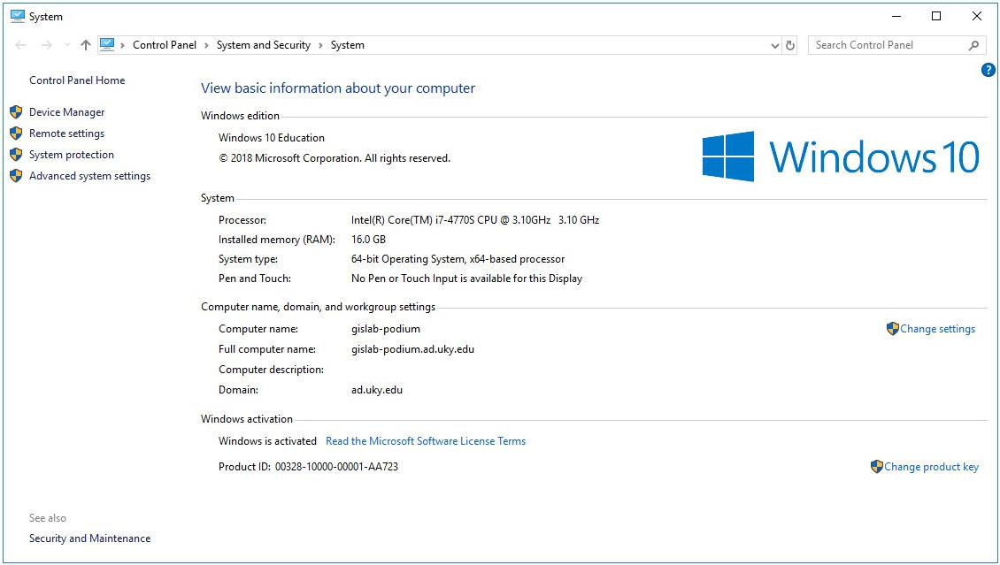
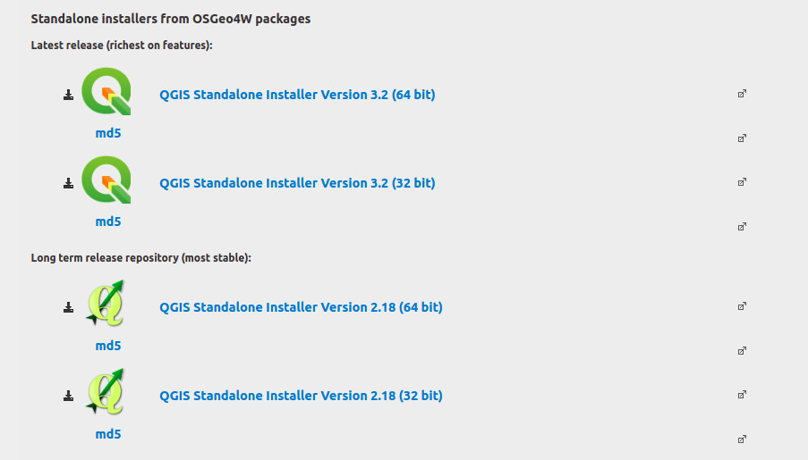
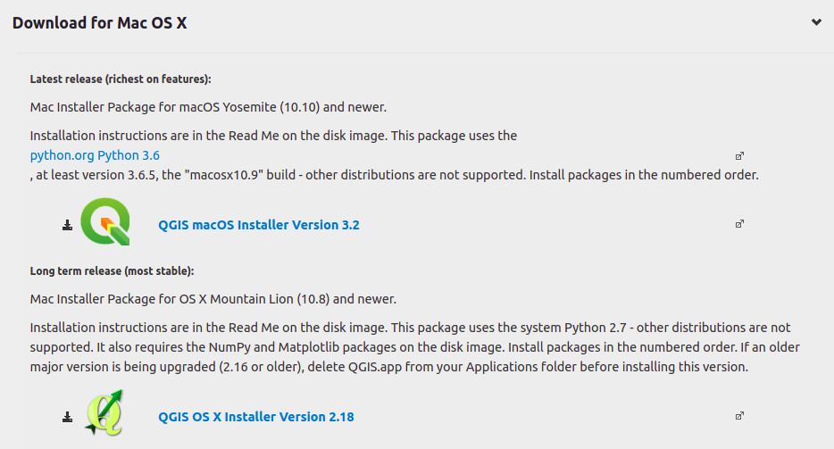

# Geography 109

# Mapping 4: Introduction to QGIS-Installation Instructions

This exercise involves a mapping process commonly used by professional cartographers. As such, you’ll use data in new ways—be patient! By engaging more deeply with data, you’ll start to understand the moving parts of making digital maps that are often hidden from their users.

In particular, this assignment will introduce data preparation in Microsoft Excel and visualization in QGIS, a free and open-source software (FOSS). The 3-part assignment will be completed over the three recitation sections. **Before section** week 6, download QGIS to your computer. In section, you will import county geometry.

### This assignment will take three recitation sections to complete; therefore it is crucial that you attend each recitation and arrive on time.

### Grading and Deliverables

The assignment is worth 50 points. Grading will be based on a Word document/PDF that you will upload to Canvas during Week 8. This document should include:

1. Your two exported maps (20 points),
2. Your responses to the questions in each part (30 points)

**Due:** Consult the [syllabus schedule](../../syllabus.md#viii-schedule) for the due date of this assignment.

**Note:** You must come to recitation week 6 with QGIS installed.

Part 1 questions must be answered and shown on your screen at the beginning of section Week 7. You will receive points in section for having these parts done.

Be conscious of saving and storing your data, either on a thumbdrive, space you know is secure on the UK drive, on cloud storage, or your laptop. It is your responsibility to save your data securely.

### Before you begin (do this before week 6): Install QGIS

### If using Microsoft Windows…

1. Determine if you are a running 32- or 62- bit version of Windows by pressing WIN+X (windows key plus X) and selecting “system.”

If using Windows 7 or XP, visit http://windows.microsoft.com/en-us/windows/32-bit-and-64-bit-windows#1TC=windows-7/ for directions.

2. Open a web browser and go to https://www.qgis.org/en/site/forusers/download.html.

3. Download and run the appropriate installer. The default settings should work just fine for our purposes.

### If using Mac OS X…

**Note:** You must follow the download instructions from the QGIS download site carefully.

1. First, because Macs are configured to not accept downloads that are not from the Mac App Store, you will probably have to change their security settings:

    * Go to System Preferences > Security & Privacy > Allow apps downloaded from:
      * Anywhere

2. Open a web browser and go to https://www.qgis.org/en/site/forusers/download.html.

3. Click “Download for Mac OS X.” 

4. Download the appropriate installer. As noted in the Download section, if you choose to install QGIS 3.2, you need to have Python 3.6 installed.

    * Follow the link to install Python 3.6 or higher if you do not have it installed on your Mac.
    * If you do not or cannot install Python 3.6, the QGIS 2.18 installer will also work for Mapping 4.

5. Run the downloaded installer.
