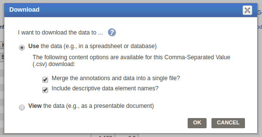

# Geography 109

# Mapping 4: Introduction to QGIS: Part 2

This exercise involves a mapping process commonly used by professional cartographers. As such, you’ll use with data in new ways—be patient! By engaging more deeply with data, you’ll start to understand the moving parts of making digital maps that are often hidden from their users.

In particular, this assignment will introduce data preparation in Microsoft Excel, and visualization in QGIS, a free and open-source (FOSS) software. The 3-part assignment will be completed over the three recitation sections. In Week 6, you will have imported county geometry. In Week 7, you will download tabular data from FactFinder2 and use Excel to clean the data. In Week 8, you will join the tabular data to the county geometry and produce choropleth maps similar to those produced by Social Explorer in Mapping 4. Take these timelines seriously otherwise you’ll have trouble completing the assignment. 

### This assignment will take three recitation sections to complete; therefore it is crucial that you attend each recitation and arrive on time.

**Due:** Consult the [syllabus schedule](../../syllabus.md#viii-schedule) for the due date of this assignment.

**Note:** You must come to recitation week 6 with QGIS installed.

Part 1 questions must be answered and shown on your screen at the beginning of section Week 7
Part 2 must be completed and shown on your screen at the beginning of section Week 8
You will receive points in section for having these parts done. 

Be conscious of saving and storing your data, either on a thumbdrive, space you know is secure on the UK drive, on cloud storage, or your laptop. It is your responsibility to save your data securely.

### Grading and Deliverables 

The assignment is worth 50 points. Grading will be based on a Word document that you will upload to Canvas during Week 11. This document should include:

1.  Your two exported maps (20 points),
2.  Your responses to the questions in each part (30 points)

**Due:** Consult the [syllabus schedule](../../syllabus.md#viii-schedule) for the due date of this assignment.

**Note:** Tips for Working with Excel are listed after Step 10. I recommend reading them before getting started, but don’t get hung up on them if they don’t help you; they’re optional. **Do, however, save your work as you go along, and consider bringing a thumb drive to section.**

## Part 2. Downloading and Cleaning Census Data

1. Go to http://factfinder2.census.gov. Click on “Advanced Search” in the blue bar at the top of the screen.

2. Once the advanced search interface appears, click on “Geographies” along the left side of your screen.

3. Under “select a geographic type,” choose “County – 50” and select the state of Kentucky. Select “All Counties within Kentucky” in the box below. Finally, click “add to yourselections” and close the select geographies dialogue. You’ve now specified that you’reinterested in county geographies, specifically those within the state of Kentucky. Closethe window.

4. Use the “Show results from” drop-down menu in the upper right corner of the interface to limit the results of your query to data from 2010. Under the ‘available programs’ dropdown menu, select “Decennial Census.” As you know, the Census is decennial,meaning every ten years.

5. Click on “Profile of General Population and Housing Characteristics: 2010” (based on the 2010 **SF1 100%** Data; see above). Do not check off the box to the left of this or yourdownload will be different than shown here.

6. You now need to download the data. To do so, click the “Download” button.

7. Specify what file format you’d like to download that data. Select “Data and annotations in a single file” and “include descriptive element names” under “Comma delimited(.CSV) format (data rows only)”. (You do not want any “Presentation Ready Formats”because you will be creating your own visualizations of the data.) Click “OK” andFactFinder2 will prepare your data for download. When it is prepared, click “Download”to save the data to your local disk. Choose a location that you will be able to locate again. _For the curious: CSV stands for **C**omma **S**eparated **V**alues and is an example of what’scalled a text-delimited file type, meaning that it uses text to separate, or delimit, individual values it stores._

8. You now need to clean the data you’ve downloaded. Find the .zip file that you just downloaded (it will be named DEC_10_SF1_SF1DP1.zip) and extract it. If you’re usinga PC: right-click the file and selecting “Extract All.” The default settings should workfine. If you’re using a Mac: double-clicking the .zip file will automatically extract it. (Tip: Create a folder with a name you will remember, on your desktop. When askedwhere to extract, click Browse, choose the desktop, create a new folder, and name itsomething like “M4 KY County Data.” Select this folder, and then click “extract.”)

9. Open “DEC_10_SF1_SF1DP1_with_ann.CSV” (see screenshot below) in Microsoft Excel. Delete the top row by right-clicking the “1” in the upper-left corner of the spreadsheet and selecting “delete.”

10. FactFinder has given us a huge amount of data, but we’re only interested in some of the attributes. In particular, we’re looking for data on each county’s **total population,median age, single fathers, and single mothers**. In the CSV files these are named asfollows:

	- **Total Population:** Number; SEX AND AGE - Total Population
	- **Median Age: Number:** SEX AND AGE - Total population - Median age (years)
	- **Total single mothers:** Number; HOUSEHOLDS BY TYPE - Total households - Familyhouseholds (families) [7] - Female householder, no husband present - With own childrenunder 18 years
	- **Total single fathers:** Number; HOUSEHOLDS BY TYPE - Total households - Familyhouseholds (families) [7] - Male householder, no wife present - With own children under18 years

11. To make this data easier to work with in Excel, **delete the other attributes in the spreadsheet**, keeping only those listed above **and those currently named “Id,” “Id2,”and “Geography.”** (Keeping or deleting attributes in the excel chart will not affect ourmap, just our efficiency and peace of mind in Excel). Deleting a column is like deleting arow (see step 9): right-click the letter above the column and select “delete.”

	- **Tip 1:** You can click and drag to highlight multiple columns for deletion at once. Youcan also use the “find” function (CTRL+F on PC, command+F on Mac) to find thecolumns you’re interested in more quickly.

	

	- **Tip 2:** You can also format the top row with the names to make them easier to find byselecting that row, clicking “Format Cells” then under the “Alignment” tab in the dialogue box that comes up, check the box next to “Wrap Text.” It will then look like theimage below:

	

	- **Tip 3:** You can also use the “find” function in Excel to find these columns: copy thecolumn names listed above in step 10 and paste them into the “find” box. Make sure thatno rows or columns are selected before you search, or it will only search in that row/column. Alternately, highlight the entire chart first.

	- **Tip 4:** Once you find the columns you are keeping, you might fill them in with a color tomake sure you don’t accidentally delete them.

	

	- **Tip 5:** Save your work as you go!!!

12. Rename the remaining seven attributes “ID,” “GEOID,” “LABEL,” “TOTPOP,” “MEDAGE,” “SINGDADS,” and “SINGMOMS.” Your spreadsheet should now looklike the screenshot below.

13. Remove all formatting from the file by selecting every cell in the spreadsheet (CTRL-A on PC, Command+A on Mac), clicking the “Home” tab up top, and using the clear button (represented by an eraser) to “Clear formats.” You won’t see any changes, but this makesthe data more readable by QGIS.

14. Format the attribute you’ve renamed “GEOID” as a **text field** – to do so, right click the GEOID column, select “Format Cells,” and select “Text.” Click OK.

15. Format the “TOTPOP,” “MEDAGE,” “SINGDADS,” and “SINGMOMS,” attributes as **number fields** – to do so, select and right-click all the appropriate columns, selectFormat Cells,” and select “Number.” You can leave the default setting; click OK.

16. Save your work as new CSV file called: YourLastName_M4Data.CSV (e.g.“Kaufman_M4Data.CSV”). If you are using Mac OS, **you must select Windows-compatible CSV from the drop-down menu below the prompt where you’ve enteredthe filename.** Save this file in a place where you can easily access it. You may want to **email it to yourself or save it to a USB thumb drive.**

### Part 2 Questions

Respond to each of the following questions. Make sure you provide evidence for your claims where necessary, about 2 sentences per question.

1. In the context of this assignment, what is an attribute? List two examples of attributes included in the CSV file you saved. **You may need to review your lecture notes for this.**
2. Why did we take the time to “clean up” the census data? (Hint: review the instructions for pointers on this)
3. What kind of data is this census data, and what makes it so?
    * individual or aggregate?
    * discrete or continuous?
    * qualitative or quantitative?
