# Geography 109

# Mapping 4: Introduction to QGIS: Part 3

### Grading and Deliverables 

The assignment is worth 50 points. Grading will be based on a Word document that you will upload to Canvas during Week 11. This document should include:

1. Your two exported maps (20 points),

2. Your responses to the questions in each part (30 points)

**Due:** Consult the [syllabus schedule](../../syllabus.md#viii-schedule) for the due date of this assignment.

Part 2 must be completed and shown on your screen at the beginning of section Week 8

You will receive points in section for having these parts done.

## Part 3: Perform a Join and Make a Choropleth Map

1. Open QGIS and add the Kentucky counties shapefile. Consult Part 1 if you get stuck.

2. Since our goal is to make this shapefile relate to the tabular dataset we just ‘cleaned’ in Excel, you must also import the CSV file into QGIS. To do this, click the “Add delimitedtext layer” button on the left side of the screen.

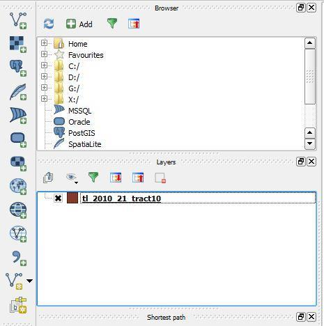

3. You will then click Browse...

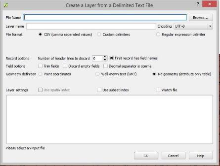

4. And locate the CSV file you saved in Excel.

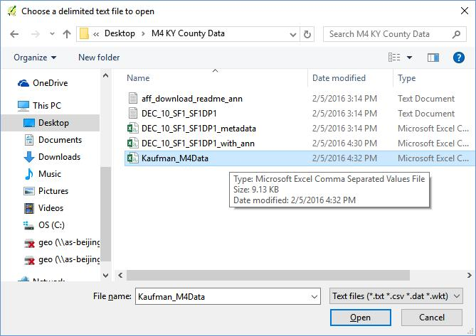

5. After locating the CSV file, QGIS will automatically do its best to interpret the information contained in the CSV. Make sure that the “Geometry definition” option is setto “No geometry (attribute only table).” This simply means that QGIS should not belooking for spatial information in the data table. Until this option is selected, QGIS willbe confused and won’t let you click OK. Click OK.

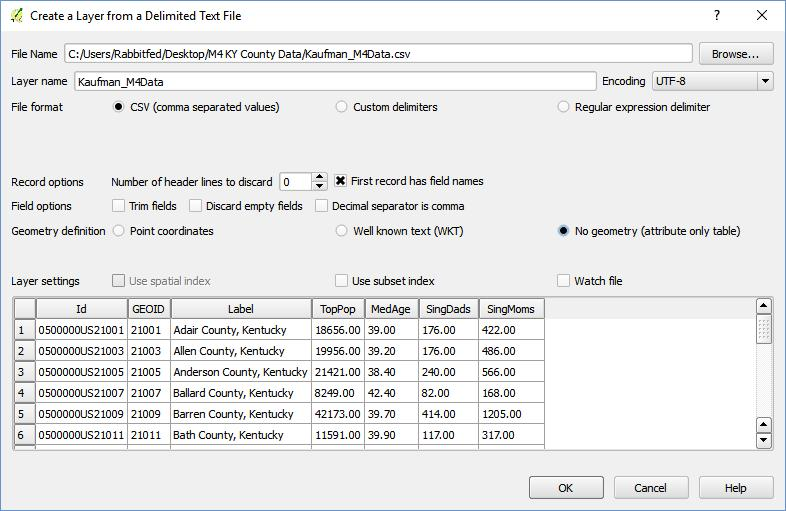

6. We now have both ingredients we need to execute our join – we will join the tabular dataset that contains the information we’re interested in, with the spatial dataset. Toexecute the join, right-click the Shapefile layer (not the CSV file) in the layers pane andselect “Properties.”

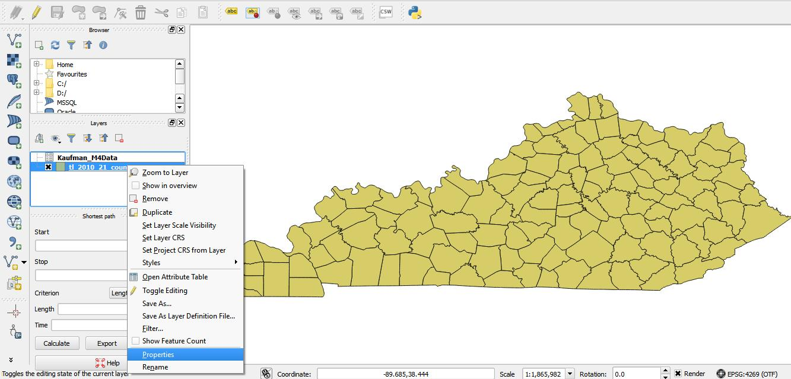

7. Select “Joins” on the left side of the properties pane, click the green plus sign in the bottom left corner...

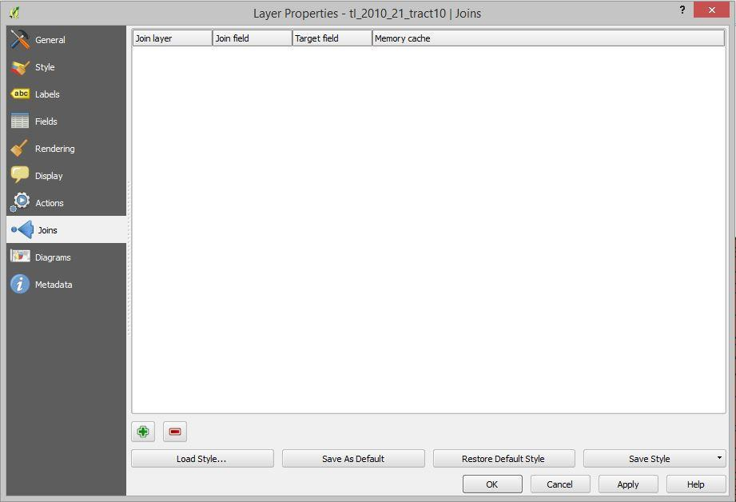

8. The prompt that appears requires that you select a join layer (the layer that will be joined to the shapefile), a join field (the field in the tabular dataset that matches with a field inthe spatial dataset), and a target field (the field in the spatial dataset that matches). **Remember these terms for the questions!** Once your screen looks like the screenshot below, click OK. If you have questions aboutthis, ask. Join operations are slightly complicated but are critically important to professional GIS work.

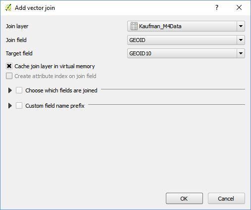

Then click OK on the ‘Layer Properties’ window and close it.

9. It might look like nothing happened, but something has. Right-click the shapefile in your layer pane and select “Open Attribute Table.” If you scroll all the way to the right, you’ll see that the fields you were working with in Excel have now been joined to the shapefile. **This ability to join non-spatial data to spatial datasets is central to what makes GIS software so powerful.**

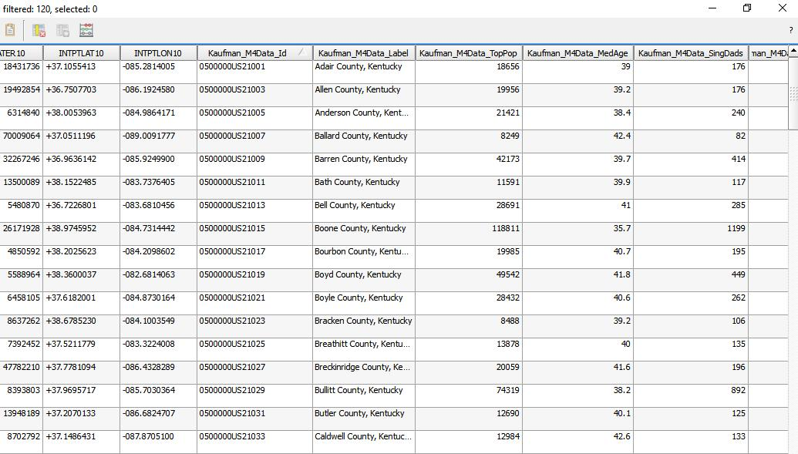

10. Close the attribute table. Right-click your shapefile and open the properties again. This time, click “Style” and, using the drop-down menu in the upper-left corner, change themode from Single Symbol to Graduated.

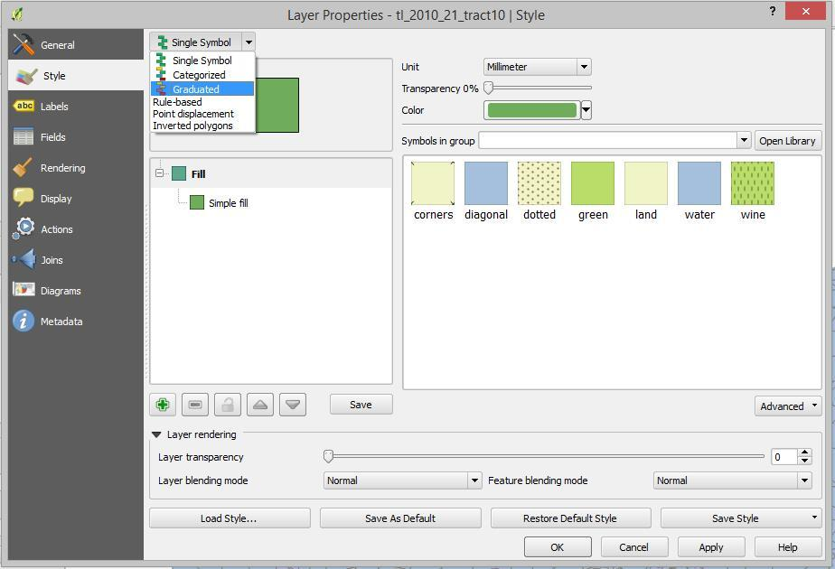

11. Click the Expression button, symbolized by an upper-case Greek epsilon.

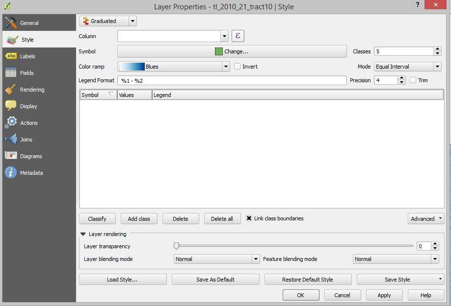

12. In the expression dialogue box, click “Fields and Values” to view a list of fields on which you can base your visualization. (On a Mac, click the triangle next to “Fields and Values”)

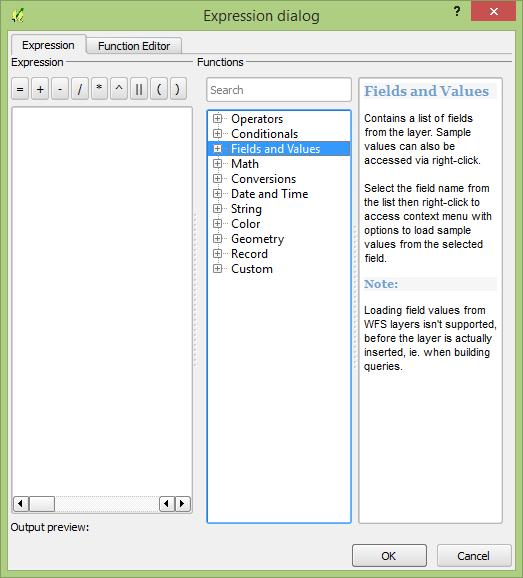

13. Select the SINGMOMS and TOTPOP variables from the “Fields and Values” list by double clicking and separate them with a slash (for example, “Kaufman_M4Data_SINGMOMS” / “Kaufman_M4Data_TOTPOP”). **Then click OK.**

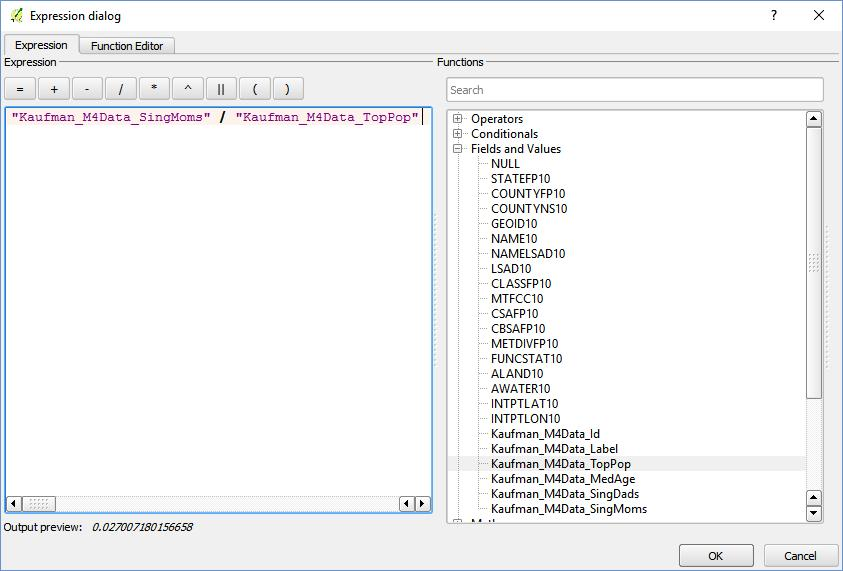

14. Select classify. Your window should now look like the screenshot below. Click OK.

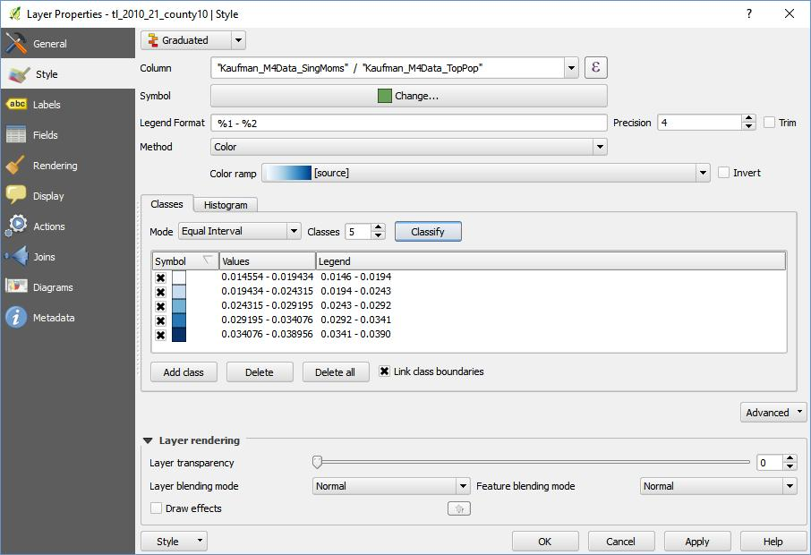

Celebrate your newly symbolized map!

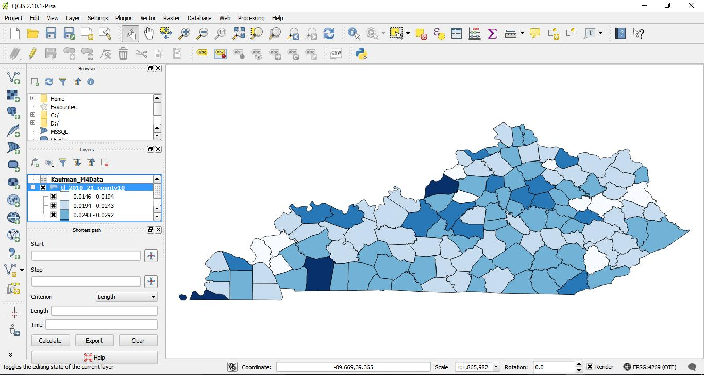

15. Notice how the map looks flat—a little squashed? We need to project it. Click on the EPSG icon in the lower right corner (oddly enough this stands for European Petroleum Survey Group, which compiled a list of projected coordinate systems that we can use)

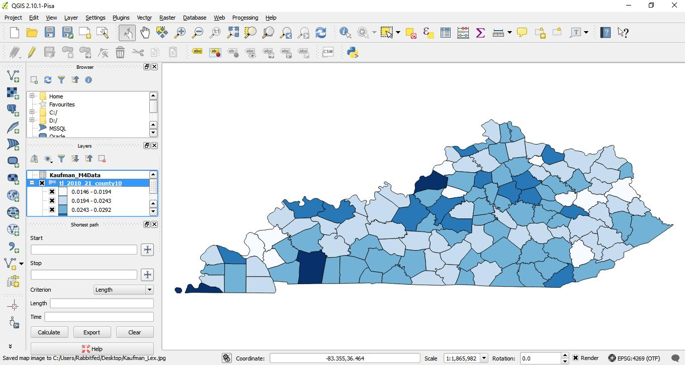

16. You will now be in the Project Properties dialogue box; choose your projection for this map project (we’re working on the whole map project now, not just a particular layer).Check the box at the top to “Enable ‘on the fly’ CRS transformation.” This means roughly that if you bring in different layers that have different coordinate systems, QGISwill do its best to make them fit together ‘on the fly’.

    * We won’t tell you which projection to use—start your search in the Krygier/Wood book, and continue on the web if you like.
    * The best projection will differ depending on the scale of your map (world, Mainland US, all US, North America, Kentucky, Lexington). Do some research on the best projection for your area, and be able to defend your choice.
    * Although there’s not necessarily a right/wrong projection, here are some considerations:
        * Are you mapping routes, such as highways, or migratory paths? If so, consider an equidistance projection (which preserves distances but distorts areas and shapes)?
        * Is area a key part of your map? In a choropleth map, you map percentages by area.Consider using an equal area projection (which preserves area, but distorts shape).
        * There are specific projections for North America and the U.S.
        * Conic projections are pretty interesting on the global scale, but more standard for the U.S.
        * There are many Universal Transverse Mercator (UTM, not the same as Mercator) projections specific to smaller areas, such as a state.
    * Scroll through the list of all of the Coordinate reference systems in the second menu or use the "Filter" field to search for the specific Coordinate Reference System you want. Once you find it, select it, and click "OK."

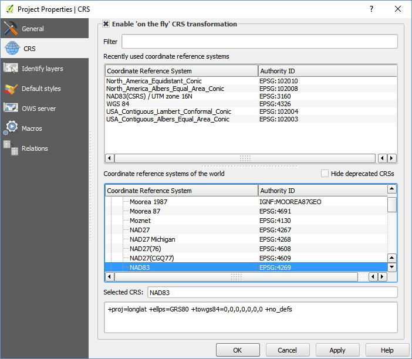

17. **Export two maps:** one zoomed in to the scale of Lexington and one of Kentucky as a whole, **both in your new projection**. In each case, **position the map appropriately** and **decide on a suitable zoom level**.

    * Then click Project> Save as Image, select “JPG” from the dropdown menu, and save as “YourLastName_Lex.jpg” and “YourLastName_KY.jpg,” respectively.
    * Scroll down below for example-screenshots of these two different images.

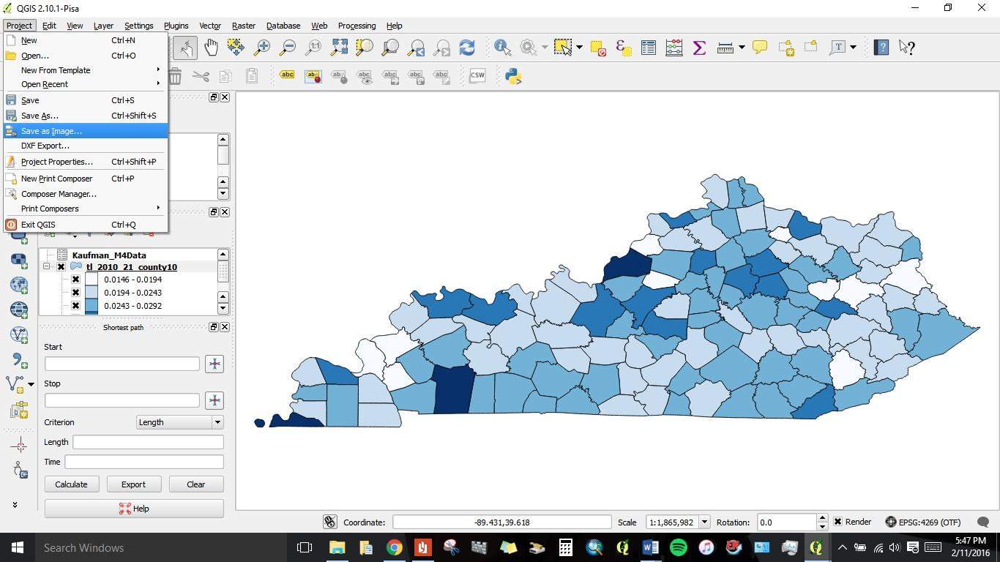

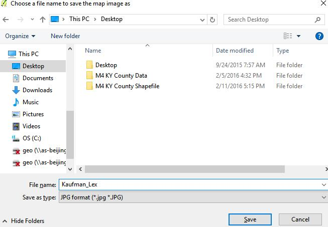

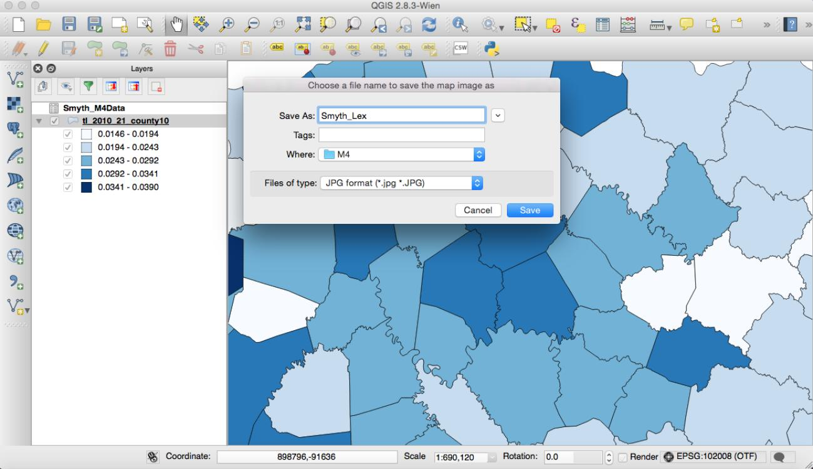

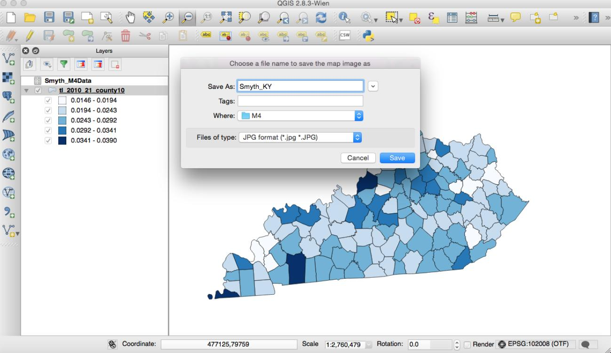

### Part 3 Questions

Respond to each of the following questions. Make sure you provide evidence for your claims where necessary. You are required to cite both books in Q. 3.

Answers should be about a paragraph for each question.

1. In this assignment, you performed an operation called a **tabular join**.
	1. What allowed us to do this (i.e., what might the datasets have had in common)?
	2. Which column in each dataset did you select to complete the join?
2. 
	1. To what do the SINGMOMs and TOTPOP attributes refer?
	2. Why, in step X, did you divide the SINGMOMs variable by the TOTPOP variable?
	3. To what does the resulting value refer?
3. Which projection do you think is best for this map, and why? Reference Crampton and Krygier and Wood.

### _You have completed M4._

### _Upload your Word document to Canvas._

