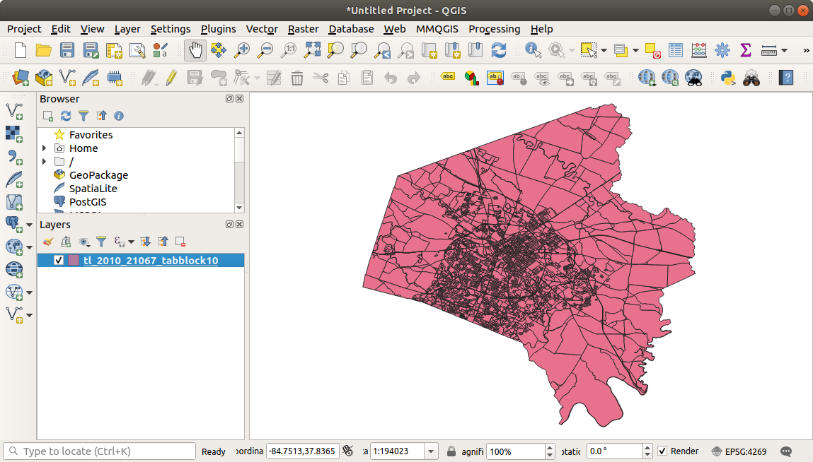
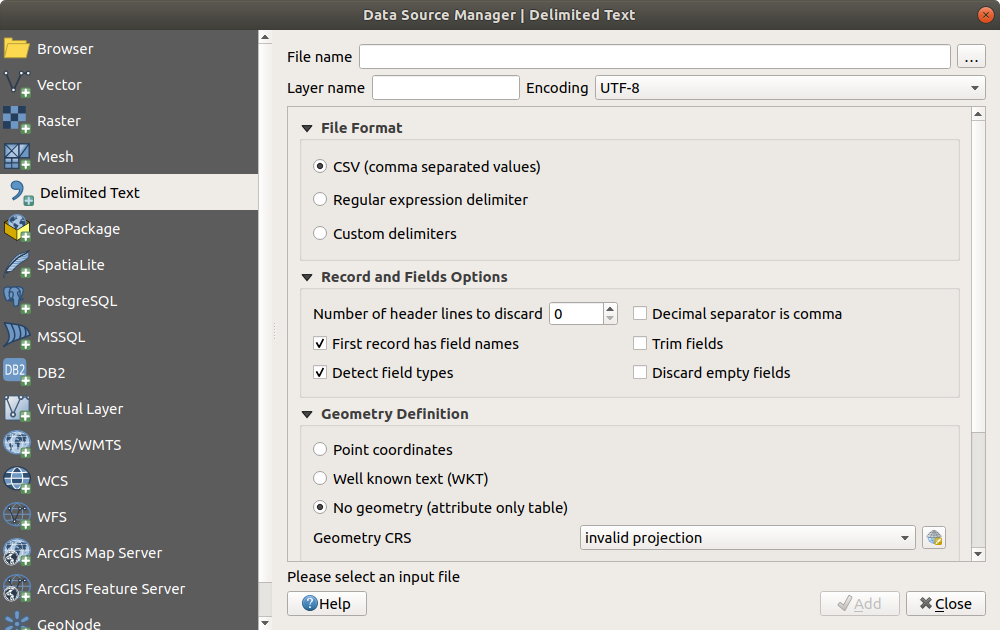
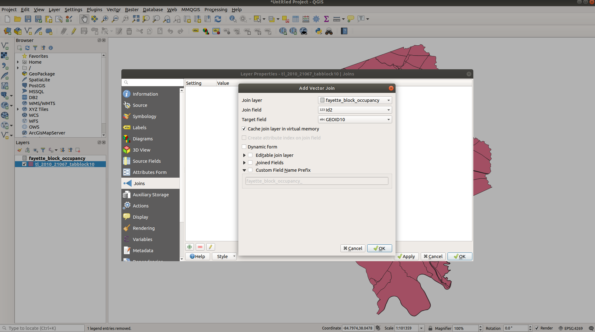
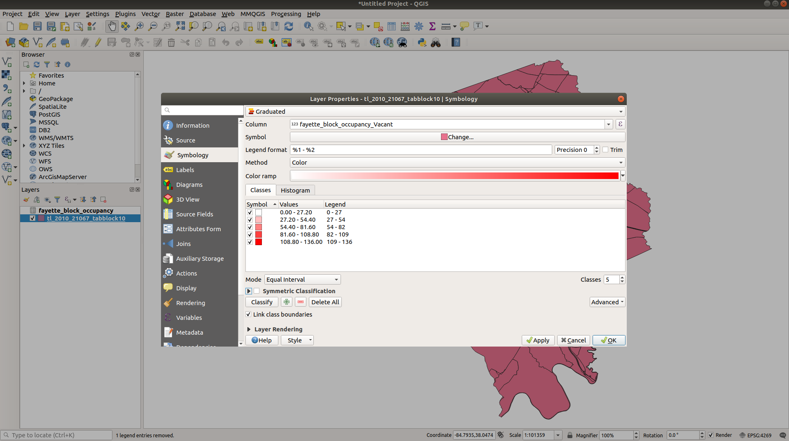
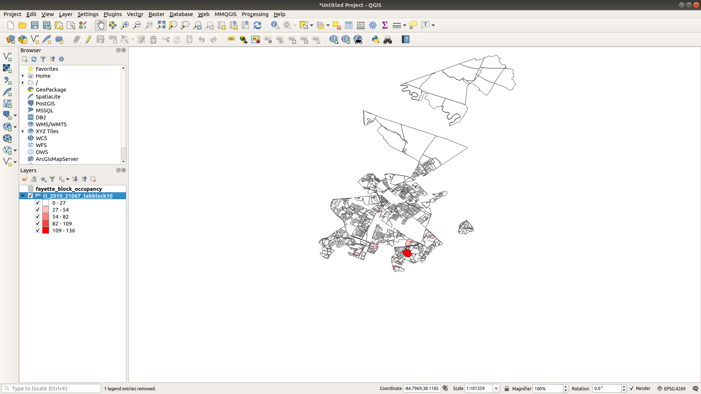
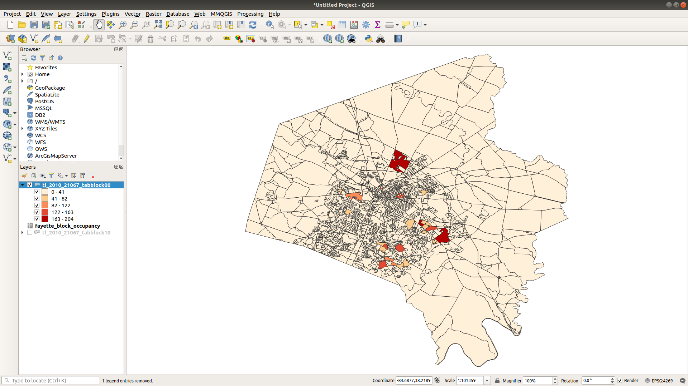

# Geography 109: Digital Mapping Mapping 5: Missing Data

University of Kentucky
 Matthew W. Wilson

In this exercise, you will work with a data set of unknown origin where values maybe be missing and you as a GIS specialist have to explain why the data is missing, how to address this issue, and what the implications for missing or misused data may be. Use QGIS and US Census data to explore this issue in fuller detail through the exercise.

**Note** You may need a review on how to manipulate data and render it in QGIS. Refer to [Mapping 4](../mapping-4/README.md) for additional details.

## Instructions

1. Your associate has handed you a file on occupancy in Fayette County, KY. There was no information on how old this data is, but they stated that the person they received it from said it was recent information. They have tasked you with mapping areas of high vacancy in Fayette county. Open [the file](assets/fayette_block_occupancy.csv) in Excel (or spreadsheet program of your choice) and exam the data.

2. We notice that the data contains numbers of total, occupied, and vacant households in the Fayette County area at the block level. Now that we know our data set contains vacancy information, we need to find a spatial data set to join our data to. Open QGIS and load a recent data set from the US Census Bureau for [2010 Fayette County Blocks](assets/tl_2010_21067_tabblock10.zip).

3. Unzip the above file and load the shapefile it into QGIS.

  

4. We now need to load the occupancy data into QGIS and join it to our shapefile. First, use the **Delimited Text** import tool to bring our CSV data into QGIS. Note that this CSV contains only attributes.

  

5. We can make the join using **Id2** in the occupancy data set to the **GEOID10** column in our shapefile.

  

6. Next we can create our choropleth. We want to create a graduate symbolization of vacancy data, binned into 5 ranges of values. 

  

7. As we can see, much of Fayette County has no data at the block level for vacancies based on our provided occupancy data set.

   

8. **Open the attribute tables** for the 2010 census block shapefile and the occupancy CSV file. You will notice that in 2010 there are 4151 blocks in the shapefile, but only 2633 rows of information in our occupancy data set. That is a lot of missing data!

9. Now we have to think. We have to get information on vacancies for all of Fayette county based on the provided data set. You contact the person who provided the data and they state that it is the correct data set they need and that it has all the information for Fayette County. After conveying our intial results, we then start searching for an explanation. Upon searching the US Census website and online for information, we found out that in the 2000 US Census, there were only 2633 block in Fayette County. Now we're getting somewhere!

10. Download the [2000 Fayette County Blocks](assets/tl_2010_21067_tabblock00.zip), unzip the file, and then load it into QGIS. Looking at the attribute table confirms there are 2633 blocks in this data set. Excellent!

11. Perform a join with the same occupancy data set using **Id2** and **BLKIDFP00** columns (notice how column labels change between 2000 and 2010 census).

12. Set the symbology the same as before for our choropleth and apply the changes.

  

13. Now we have an accurate map for all vacancies in Fayette county for 2000. We now have to respond to the person who provided the occupancy data set to let them know this is not the most recent information and that new data must be obtained for the most recent Fayette County information.

## Questions

1. In reviewing the occupancy data, what does the value of zero mean? Is this different than having no value at all? Explain your answer.

2. How did we know there was data missing in our 2010 census block map? Is is possible that the occupancy data was actually 2010 information? How would we go about confirming the age and origin of the occupancy data?

3. When is missing data a useful problem? What can missing data tell us about the phenomena we are mapping?